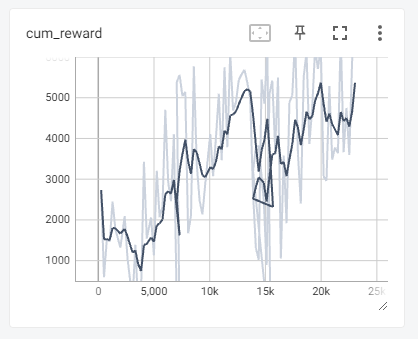

[![LinkedIn][linkedin-shield]](https://www.linkedin.com/in/graham-m-thomas)

<br />
<div align="center">
  <a href="https://github.com/grahammthomas/MapleAITrainer">
    
  </a>

<h3 align="center">Maplestory AI Trainer</h3>

  <p align="center">
    Uses screen captures, OCR, and Reinforcement Learning to optimize training on a specific map in Maplestory
  </p>
</div>

<!-- TABLE OF CONTENTS -->
<details>
  <summary>Table of Contents</summary>
  <ol>
    <li>
      <a href="#about-the-project">About The Project</a>
      <ul>
        <li><a href="#built-with">Built With</a></li>
      </ul>
    </li>
    <li>
      <a href="#getting-started">Getting Started</a>
      <ul>
        <li><a href="#prerequisites">Prerequisites</a></li>
        <li><a href="#installation">Installation</a></li>
      </ul>
    </li>
    <li><a href="#usage">Usage</a></li>
    <li><a href="#roadmap">Roadmap</a></li>
    <li><a href="#contributing">Contributing</a></li>
    <li><a href="#license">License</a></li>
    <li><a href="#contact">Contact</a></li>
    <li><a href="#acknowledgments">Acknowledgments</a></li>
  </ol>
</details>

<!-- Demo -->
## Demo
> Following demo is completely run via AI.


<!-- ABOUT THE PROJECT -->
## About The Project

The projects functions by first taking a screenshot of the maplestory screen. It then crops out the exp and health locations of the screen. The reward is comprised of `amount of exp gained - amount of health lost`. There are 3 [multi discrete](https://stable-baselines3.readthedocs.io/en/master/guide/rl_tips.html#discrete-actions) actions the AI can take and any one time using.

1. Moving: `left, right, up down`
2. Attacking: `basic attack, power attack (lucky seven)`
3. Misc: `Pick up item, Jump`

At first, the model was done training after about 300 steps. It was just walking into a wall and attaching constantly. Researched a bit and lowered the learning rate, adjusted the gamma, and raised the batch size. This produced decent results.

Creates a customer environment using [stable baselines3](https://stable-baselines3.readthedocs.io/en/master/index.html). Utilzes the `PPO` modules with `CnnPolicy` as it's good for pixel-based input.

<!-- GETTING STARTED -->
## Getting Started

### Prerequisites

- Install python [3.11](https://www.python.org/downloads/release/python-3114/)
- Install Tesseract-ocr [source](https://github.com/tesseract-ocr/tesseract#installing-tesseract)

### Installation

1. Clone the repo

   ```sh
   git clone https://github.com/GrahamMThomas/MapleAITrainer.git
   ```

2. Create virtualEnv and install requirements

   ```sh
   python -m venv venv
   ./venv/scripts/Activate
   pip install -r requirements.txt
   ```

3. Run Training

    ```sh
    python train.py
    ```

- `check_env.py` - Checks env for method signatures and input outputs are valid
- `test_env.py` - Runs random commands on your environment to ensure it works
- `run_latest.py` - Loads the latest_model and runs the environment using it to drive commands w/o training

### Running Metrics

Launch Tensorboard

`tensorboard --logdir .\logs\`




> Had to backtrack around 15k steps as training was invalid

<p align="right">(<a href="#readme-top">back to top</a>)</p>


## Roadmap

* [ ] Use ratios to load health, exp, and maple admin locations. Currently breaks if you go to another computer which runs at a different resolution
* [ ] Preprocess data. Currently we send a lower rez screenshot to the model as input. I think there is a lot of noise and stuff like ladders/steps aren't detected well. By using OCR to locate player, enemies, ladders, steps, floors etc, I may be able to improve model performance.
* [ ] Use minimap to punish the AI for staying in one area too long as enemies may have accumulated in other areas.

See the [open issues](https://github.com/GrahamMThomas/MapleAITrainer/issues) for a full list of proposed features (and known issues).

<p align="right">(<a href="#readme-top">back to top</a>)</p>


<p align="right">(<a href="#readme-top">back to top</a>)</p>

<!-- MARKDOWN LINKS & IMAGES -->
<!-- https://www.markdownguide.org/basic-syntax/#reference-style-links -->
[linkedin-shield]: https://img.shields.io/badge/-LinkedIn-black.svg?style=for-the-badge&logo=linkedin&colorB=555
